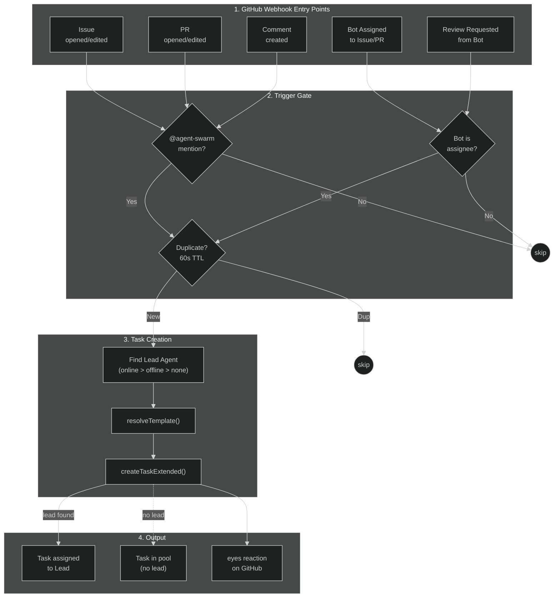
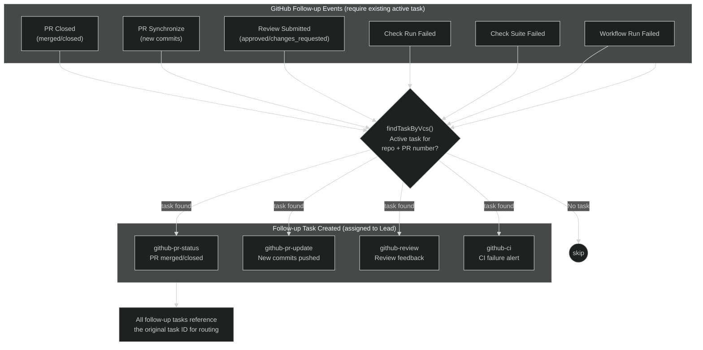
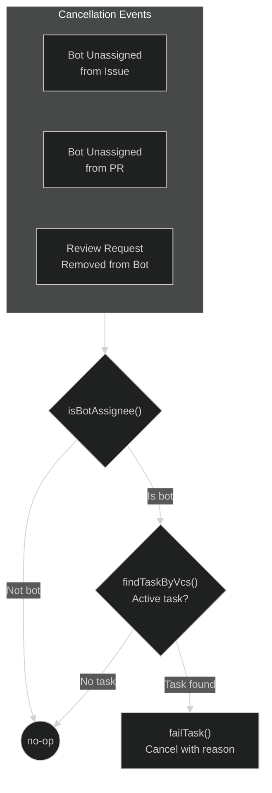

<p align="center">
  <a href="https://github.com/desplega-ai/agent-swarm/stargazers"></a>
  <a href="https://github.com/desplega-ai/agent-swarm/blob/main/LICENSE"></a>
  <a href="https://github.com/desplega-ai/agent-swarm/pulls"></a>
  <a href="https://discord.gg/KZgfyyDVZa"></a>
  <a href="https://docs.agent-swarm.dev"></a>
</p>

<p align="center">
  <b>Multi-agent orchestration for Claude Code, Codex, Gemini CLI, and other AI coding assistants.</b><br/>
  <sub>Built by <a href="https://desplega.sh">desplega.sh</a> — by builders, for builders.</sub>
</p>

https://github.com/user-attachments/assets/bd308567-d21e-44a5-87ec-d25aeb1de3d3

<p align="center">
  <a href="https://agent-swarm.dev">
    
  </a>
  <a href="https://docs.agent-swarm.dev">
    
  </a>
  <a href="https://app.agent-swarm.dev">
    
  </a>
  <a href="https://discord.gg/KZgfyyDVZa">
    
  </a>
  <a href="https://x.com/swarm_lead">
    
  </a>
</p>

> **What if your AI agents remembered everything, learned from every mistake, and got better with every task?**

Agent Swarm lets you run a team of AI coding agents that coordinate autonomously. A **lead agent** receives tasks (from you, Slack, or GitHub), breaks them down, and delegates to **worker agents** running in Docker containers. Workers execute tasks, report progress, and ship code — all without manual intervention.

## Key Features

- **Lead/Worker coordination** — A lead agent delegates and tracks work across multiple workers
- **Docker isolation** — Each worker runs in its own container with a full dev environment
- **Slack, GitHub, GitLab & Email integration** — Create tasks by messaging the bot, @mentioning it in issues/PRs/MRs, or sending an email
- **Task lifecycle** — Priority queues, dependencies, pause/resume across deployments
- **Compounding memory** — Agents learn from every session and get smarter over time
- **Persistent identity** — Each agent has its own personality, expertise, and working style that evolves
- **Dashboard UI** — Real-time monitoring of agents, tasks, and inter-agent chat
- **Service discovery** — Workers can expose HTTP services and discover each other
- **Scheduled tasks** — Cron-based recurring task automation
- **Templates registry** — Pre-built agent templates (9 official: lead, coder, researcher, reviewer, tester, FDE, content-writer, content-reviewer, content-strategist) with a gallery UI and docker-compose builder
- **GitLab integration** — Full GitLab webhook support alongside GitHub via provider adapter pattern
- **Working directory support** — Tasks can specify a custom starting directory for agents via the `dir` parameter
- **Multi-provider** — Run agents with Claude Code, pi-mono, or OpenAI Codex (`HARNESS_PROVIDER=claude|pi|codex`)
- **Agent-fs integration** — Persistent, searchable filesystem shared across the swarm with auto-registration on first boot
- **Debug dashboard** — SQL query interface with Monaco editor and AG Grid results for database inspection
- **Workflow engine** — DAG-based workflow automation with executor registry, checkpoint durability, webhook/schedule/manual triggers, per-step retry, structured I/O schemas, fan-out/convergence, configurable failure handling, and version history
- **Linear integration** — Bidirectional ticket tracker sync via OAuth + webhooks with AgentSession lifecycle and generic tracker abstraction
- **Portless local dev** — Friendly URLs for local development (`api.swarm.localhost:1355`) via portless proxy
- **Onboarding wizard** — Interactive CLI wizard (`agent-swarm onboard`) to set up a new swarm from scratch with presets, credential collection, and docker-compose generation
- **Skill system** — Reusable procedural knowledge: create, install, publish, and sync skills from GitHub with scope resolution (agent → swarm → global)
- **Human-in-the-Loop** — Workflow nodes that pause for human approval or input, with a dashboard UI for reviewing and responding to requests
- **MCP server management** — Register, install, and manage MCP servers for agents with scope cascade (agent → swarm → global) and auto-injection into worker containers
- **Context usage tracking** — Monitor context window utilization and compaction events per task with visual indicators in the dashboard

## Quick Start

### Prerequisites

- [Docker](https://docker.com) and Docker Compose
- A [Claude Code](https://docs.anthropic.com/en/docs/claude-code) OAuth token (`claude setup-token`)

### Option A: Docker Compose (recommended)

The fastest way to get a full swarm running — API server, lead agent, and 2 workers.

```bash
git clone https://github.com/desplega-ai/agent-swarm.git
cd agent-swarm

# Configure environment
cp .env.docker.example .env
# Edit .env — set API_KEY and CLAUDE_CODE_OAUTH_TOKEN at minimum

# Start everything
docker compose -f docker-compose.example.yml --env-file .env up -d
```

The API runs on port `3013`. The dashboard is available separately (see [Dashboard](#dashboard)).

The API includes interactive documentation at `http://localhost:3013/docs` (Scalar UI) and a machine-readable OpenAPI 3.1 spec at `http://localhost:3013/openapi.json`.

### Option B: Local API + Docker Workers

Run the API locally and connect Docker workers to it.

```bash
git clone https://github.com/desplega-ai/agent-swarm.git
cd agent-swarm
bun install

# 1. Configure and start the API server
cp .env.example .env
# Edit .env — set API_KEY
bun run start:http
```

In a new terminal, start a worker:

```bash
# 2. Configure and run a Docker worker
cp .env.docker.example .env.docker
# Edit .env.docker — set API_KEY (same as above) and CLAUDE_CODE_OAUTH_TOKEN
bun run docker:build:worker
mkdir -p ./logs ./work/shared ./work/worker-1
bun run docker:run:worker
```

### Option C: Claude Code as Lead Agent

Use Claude Code directly as the lead agent — no Docker required for the lead.

```bash
# After starting the API server (Option B, step 1):
bunx @desplega.ai/agent-swarm connect
```

This configures Claude Code to connect to the swarm. Start Claude Code and tell it:

```
Register yourself as the lead agent in the agent-swarm.
```

## How It Works

```
You (Slack / GitHub / Email / CLI)
        |
   Lead Agent  ←→  MCP API Server  ←→  SQLite DB
        |
   ┌────┼────┐
Worker  Worker  Worker
(Docker containers with full dev environments)
```

1. **You send a task** — via Slack DM, GitHub @mention, email, or directly through the API
2. **Lead agent plans** — breaks the task down and assigns subtasks to workers
3. **Workers execute** — each in an isolated Docker container with git, Node.js, Python, etc.
4. **Progress is tracked** — real-time updates in the dashboard, Slack threads, or API
5. **Results are delivered** — PRs created, issues closed, Slack replies sent
6. **Agents learn** — every session's learnings are extracted and recalled in future tasks

## Agents Get Smarter Over Time

Agent Swarm agents aren't stateless. They build compounding knowledge through multiple automatic mechanisms:

### Memory System

Every agent has a searchable memory backed by OpenAI embeddings (`text-embedding-3-small`). Memories are automatically created from:

- **Session summaries** — At the end of each session, a lightweight model extracts key learnings: mistakes made, patterns discovered, failed approaches, and codebase knowledge. These summaries become searchable memories.
- **Task completions** — Every completed (or failed) task's output is indexed. Failed tasks include notes about what went wrong, so the agent avoids repeating the same mistake.
- **File-based notes** — Agents write to `/workspace/personal/memory/` in their per-agent directory. Files are automatically indexed and can be promoted to swarm scope.
- **Lead-to-worker injection** — The lead agent can push specific learnings into any worker's memory using the `inject-learning` tool, closing the feedback loop.

Before starting each task, the runner automatically searches for relevant memories and includes them in the agent's context. Past experience directly informs future work.

### Persistent Identity

Each agent has four identity files that persist across sessions and evolve over time:

| File | Purpose | Example |
|------|---------|---------|
| **SOUL.md** | Core persona, values, behavioral directives | "You're not a chatbot. Be thorough. Own your mistakes." |
| **IDENTITY.md** | Expertise, working style, track record | "I'm the coding arm of the swarm. I ship fast and clean." |
| **TOOLS.md** | Environment knowledge — repos, services, APIs | "The API runs on port 3013. Use `wts` for worktree management." |
| **CLAUDE.md** | Persistent notes and instructions | Learnings, preferences, important context |

Agents can edit these files directly during a session. Changes are synced to the database in real-time (on every file edit) and at session end. When the agent restarts, its identity is restored from the database. Version history is tracked for all changes.

The default templates encourage self-improvement:
- Tools you wished you had? Update your startup script.
- Environment knowledge gained? Record it in TOOLS.md.
- Patterns discovered? Add them to your notes.
- Mistakes to avoid? Add guardrails.

### Startup Scripts

Each agent has a startup script (`/workspace/start-up.sh`) that runs at every container start. Agents can modify this script to install tools, configure their environment, or set up workflows — and the changes persist across restarts. An agent that discovers it needs `ripgrep` will install it once, and it'll be there for every future session.

## Agent Configuration

### Identity Management

Agent identity is stored in the database and synced to the filesystem at session start. There are three ways to configure it:

1. **Default generation** — On first registration, the system generates templates based on the agent's name, role, and description.
2. **Self-editing** — Agents modify their own identity files during sessions. A PostToolUse hook syncs changes to the database in real-time.
3. **API / MCP tool** — Use the `update-profile` tool to programmatically set any identity field (soulMd, identityMd, toolsMd, claudeMd, setupScript).

### System Prompt Assembly

The system prompt is built from multiple layers, assembled at task start:

1. **Base role instructions** — Lead or worker-specific behavior rules
2. **Agent identity** — SOUL.md + IDENTITY.md content
3. **Repository context** — If the task targets a specific GitHub repo, that repo's CLAUDE.md is included
4. **Filesystem guide** — Memory directories, personal/shared workspace, setup script instructions
5. **Self-awareness** — How the agent is built (runtime, hooks, memory system, task lifecycle)
6. **Additional prompt** — Custom text from `SYSTEM_PROMPT` env var or `--system-prompt` CLI flag

### Hook System

Six hooks fire during each Claude Code session, providing safety, context management, and persistence:

| Hook | When | What it does |
|------|------|-------------|
| **SessionStart** | Session begins | Writes CLAUDE.md from DB, loads concurrent session context for leads |
| **PreCompact** | Before context compaction | Injects a "goal reminder" with current task details so the agent doesn't lose track |
| **PreToolUse** | Before each tool call | Checks for task cancellation, detects tool loops (same tool/args repeated), blocks excessive polling |
| **PostToolUse** | After each tool call | Sends heartbeat, syncs identity file edits to DB, auto-indexes memory files |
| **UserPromptSubmit** | New iteration starts | Checks for task cancellation |
| **Stop** | Session ends | Saves PM2 state, syncs all identity files, runs session summarization via Haiku, marks agent offline |

## Integrations

### Slack

Create a [Slack App](https://api.slack.com/apps) with Socket Mode enabled. Required scopes: `chat:write`, `users:read`, `users:read.email`, `channels:history`, `im:history`.

```bash
# Add to your .env
SLACK_BOT_TOKEN=xoxb-...    # Bot User OAuth Token
SLACK_APP_TOKEN=xapp-...    # App-Level Token (Socket Mode)
```

Message the bot directly to create tasks. Workers reply in threads with progress updates. Optionally restrict access with `SLACK_ALLOWED_EMAIL_DOMAINS` or `SLACK_ALLOWED_USER_IDS`.

### GitHub App

Set up a [GitHub App](https://github.com/settings/apps/new) to receive webhooks when the bot is @mentioned or assigned to issues/PRs.

**Webhook URL:** `https://<your-domain>/api/github/webhook`

**Required permissions:**
- Issues: Read & Write
- Pull requests: Read & Write

**Subscribe to events:** Issues, Issue comments, Pull requests, Pull request reviews, Pull request review comments, Check runs, Check suites, Workflow runs

```bash
# Add to your .env
GITHUB_WEBHOOK_SECRET=your-webhook-secret
GITHUB_BOT_NAME=your-bot-name           # Default: agent-swarm-bot

# Optional: Enable bot reactions (emoji acknowledgments on GitHub)
GITHUB_APP_ID=123456
GITHUB_APP_PRIVATE_KEY=base64-encoded-key
```

**Supported events:**

| Event | What happens |
|-------|-------------|
| Bot assigned to PR/issue | Creates a task for the lead agent |
| Review requested from bot | Creates a review task |
| `@bot-name` in comment/issue/PR | Creates a task with the mention context |
| PR review submitted (on bot's PR) | Creates a notification task with review feedback |
| CI failure (on PRs with existing tasks) | Creates a CI notification task |

<details>
<summary><strong>Flow Diagrams</strong> (click to expand)</summary>

#### Task Creation Flow

How GitHub events become tasks in the swarm:



[PNG fallback](assets/github-task-creation-flow.png)

#### Follow-up Flows

Events that create secondary tasks when an active task already exists for a PR:



[PNG fallback](assets/github-followup-flows.png)

#### Cancellation Flows

How unassigning the bot cancels active tasks:



[PNG fallback](assets/github-cancellation-flows.png)

</details>

### GitLab

Set up a GitLab webhook to receive events when the bot is @mentioned or assigned to issues/MRs.

**Webhook URL:** `https://<your-domain>/api/gitlab/webhook`

```bash
# Add to your .env
GITLAB_WEBHOOK_SECRET=your-webhook-secret
GITLAB_TOKEN=your-gitlab-token              # PAT or Group Access Token
GITLAB_BOT_NAME=agent-swarm-bot             # Bot name for @mentions
GITLAB_URL=https://gitlab.com               # GitLab instance URL
```

**Supported events:**

| Event | What happens |
|-------|-------------|
| Bot assigned to MR/issue | Creates a task for the lead agent |
| `@bot-name` in comment/issue/MR | Creates a task with the mention context |
| Pipeline failure (on MRs with existing tasks) | Creates a CI notification task |

Workers have `glab` CLI pre-installed for GitLab operations (creating MRs, commenting on issues, etc.).

### AgentMail

Give your agents email addresses via [AgentMail](https://agentmail.to). Emails are routed to agents as tasks or inbox messages.

**Webhook URL:** `https://<your-domain>/api/agentmail/webhook`

```bash
# Add to your .env
AGENTMAIL_WEBHOOK_SECRET=your-svix-secret
```

Agents self-register which inboxes they receive mail from using the `register-agentmail-inbox` MCP tool. Emails to a worker's inbox become tasks; emails to a lead's inbox become inbox messages for triage. Follow-up emails in the same thread are automatically routed to the same agent.

### Sentry

Workers can investigate Sentry issues directly with the `/investigate-sentry-issue` command. Add `SENTRY_AUTH_TOKEN` and `SENTRY_ORG` to your worker's environment.

## Dashboard

A React-based monitoring dashboard for real-time visibility into your swarm.

```bash
cd new-ui && pnpm install && pnpm run dev
```

Opens at `http://localhost:5173`. See [UI.md](./UI.md) for details.

## CLI

```bash
bunx @desplega.ai/agent-swarm <command>
```

| Command | Description |
|---------|-------------|
| `onboard` | Set up a new swarm from scratch (Docker Compose wizard) |
| `connect` | Connect this project to an existing swarm |
| `api`   | Start the API + MCP HTTP server |
| `claude` | Run Claude CLI with optional message and headless mode |
| `worker` | Run a worker agent |
| `lead`  | Run a lead agent |
| `docs`  | Open documentation (`--open` to launch in browser) |
| `artifact` | Manage agent artifacts |

## Deployment

For production deployments, see [DEPLOYMENT.md](./DEPLOYMENT.md) which covers:

- Docker Compose setup with multiple workers
- systemd deployment for the API server
- Graceful shutdown and task resume
- Integration configuration (Slack, GitHub, AgentMail, Sentry)

## Documentation

| Resource | Description |
|----------|-------------|
| [docs.agent-swarm.dev](https://docs.agent-swarm.dev) | Full documentation site |
| [app.agent-swarm.dev](https://app.agent-swarm.dev) | Hosted dashboard — connect your deployed swarm |
| [DEPLOYMENT.md](./DEPLOYMENT.md) | Production deployment guide |
| [Environment Variables](https://docs.agent-swarm.dev/docs/reference/environment-variables) | Complete environment variables reference |
| [CONTRIBUTING.md](./CONTRIBUTING.md) | Development setup and project structure |
| [UI.md](./UI.md) | Dashboard UI overview |
| [MCP.md](./MCP.md) | MCP tools reference (auto-generated) |

## Contributing

We love contributions! Whether it's bug reports, feature requests, docs improvements, or code — all are welcome.

See [CONTRIBUTING.md](./CONTRIBUTING.md) to get started. The quickest way to contribute:

1. Fork the repo
2. Create a branch (`git checkout -b my-feature`)
3. Make your changes
4. Open a PR

Join our [Discord](https://discord.gg/KZgfyyDVZa) if you have questions or want to discuss ideas.

## Star History

<a href="https://star-history.com/#desplega-ai/agent-swarm&Date">
 <picture>
   <source media="(prefers-color-scheme: dark)" srcset="https://api.star-history.com/svg?repos=desplega-ai/agent-swarm&type=Date&theme=dark" />
   <source media="(prefers-color-scheme: light)" srcset="https://api.star-history.com/svg?repos=desplega-ai/agent-swarm&type=Date" />
   
 </picture>
</a>

## License

[MIT](./LICENSE) — 2025-2026 [desplega.ai](https://desplega.ai)
